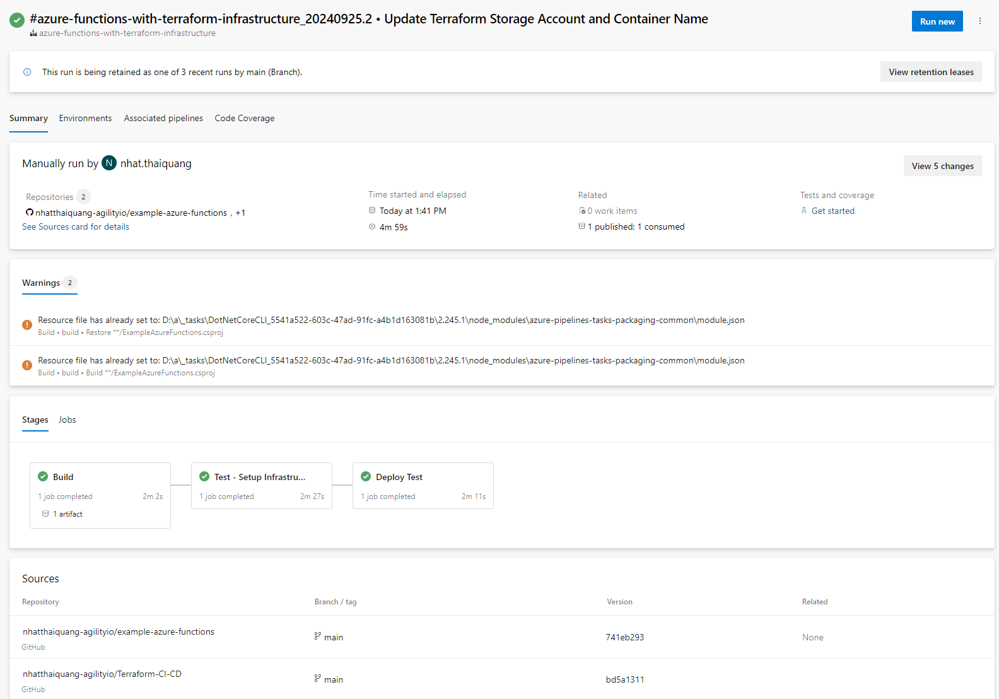

# Example Azure Functions
    - Deploy Azure Function via Azure DevOps

## Requisites
- Create an account in Azure DevOps
- Create Parallel Jobs for building and deployment app (Microsoft-Hosted)
- Link GitHub repo with Azure DevOps (GitHub Connections)
- Create a Service Connection between Azure DevOps and Azure Portal for Deployment

## Create an Azure Function example and deploy with package zip via Azure DevOps
- Create manual Azure Functions in Azure Portal
- Deploy package zip via Azure DevOps

### Check Azure Function in Azure Portal
+ Run Pipeline

+ Home Page with Environment setting (AzureWebJobsDisableHomepage=false)

+ Show Azure Functions

### Test Azure Function

## Create Azure Functions and setup infrastructure with Terraform via Azure DevOps
- Create manual ResourceGroup
- Create manual Storage Account Name & Container Name
    + Save terraform state file
- Run azure-deployment-with-terraform.yml
    + Setup Infrastructure Azure Function with Terraform
    + Deploy package zip

### Check in Azure Portal
+ Azure Deployment with Terraform

+ Store terraform file

+ Azure Function Overview

+ Test Azure Function

